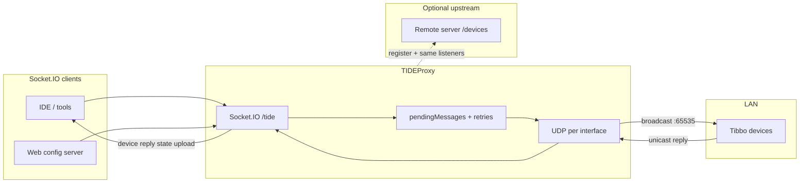
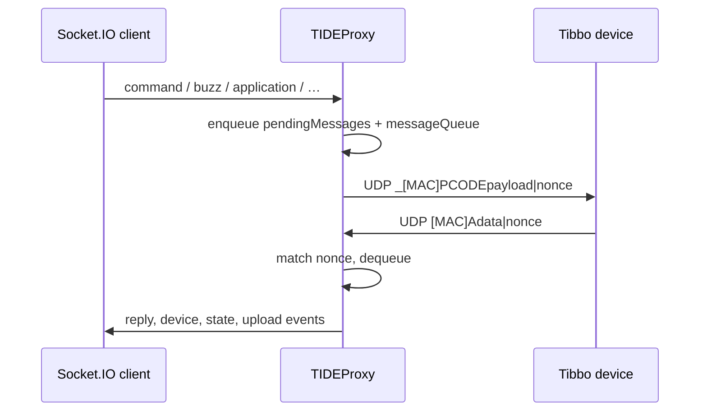
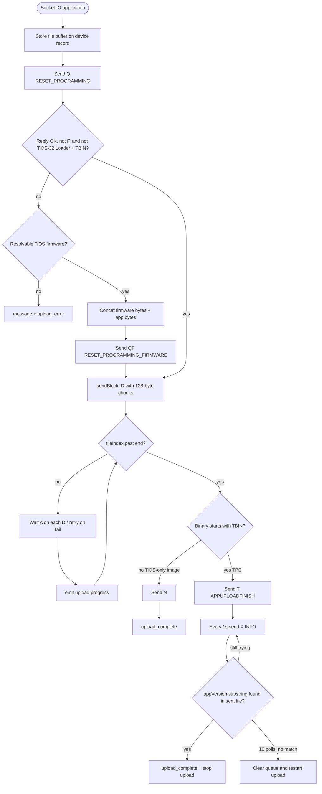
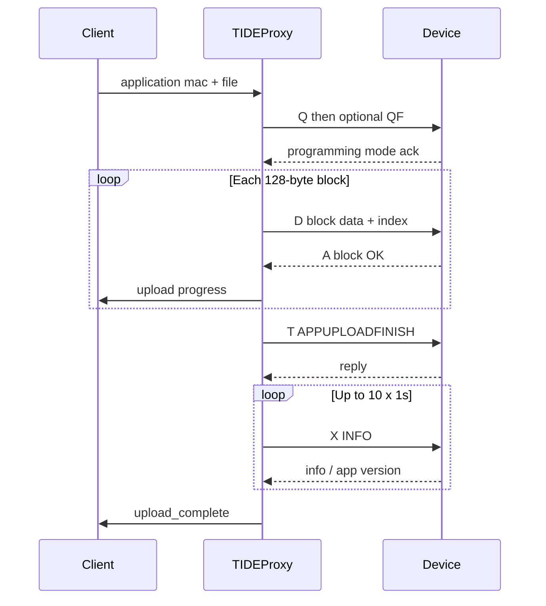

# TIDE Proxy

This module provides commands control and monitor Tibbo Devices

## Architecture and communication

The proxy sits between **Socket.IO clients** (IDE, web UI, `server.ts`, etc.) and **Tibbo devices** on the LAN. It binds a UDP socket on each non-loopback IPv4 interface, sends discovery and device traffic to the **subnet broadcast address** on UDP port **65535**, and exposes a Socket.IO namespace **`/tide`** (default HTTP port **3535**) for control and status. When a **remote server URL** is configured, the proxy also opens an outbound Socket.IO client connection so it can **register** and relay the same events to the cloud.



### Request–reply over UDP

Commands that expect an answer are queued with a **nonce**. The outbound wire format is `_[MAC]COMMANDdata|nonce` (MAC octets zero-padded). Replies from the device include the same nonce so the proxy can match them, remove the pending entry, and emit a **`reply`** (or handle uploads/state internally). Timeouts trigger **exponential backoff retries**; upload-related failures can surface as **`upload_error`** / **`message`**.



### Socket.IO: events clients send to the proxy

These are the event names the proxy listens for (namespace **`/tide`**). Payload shapes vary; see `registerListeners` in `src/tide-proxy.ts`.

| Event | Role |
|--------|------|
| `refresh` | Broadcast discovery (`_?`), clear discovery map, refresh serial ports |
| `buzz` | Device buzzer (`B`) |
| `reboot` | Stop upload if needed, reboot (`EC`) |
| `application` | Firmware / application upload pipeline |
| `command` | Generic PCODE: `command`, `data`, `mac`, optional `nonce` |
| `http` | Proxy an HTTP request; response comes back as `http_response` |
| `set_pdb_storage_address` | PDB storage address for memory helpers |
| `attach_serial` / `detach_serial` | Serial bridge for supported devices |
| `gpio_set` / `wiegand_send` | ADK HTTP posts (GPIO / Wiegand) when ADKs are configured |
| `poll_device` | Sends state poll (`PC`) for the given `mac` |

### Socket.IO: events the proxy emits to clients

| Event | Role |
|--------|------|
| `register` | Sent **to upstream** when outbound server connects (proxy name) |
| `device` | Device list / metadata updates |
| `reply` | PCODE reply matched to a prior command (not used for raw upload blocks) |
| `state` | Parsed machine state from `PC` |
| `upload` / `upload_complete` / `upload_error` | Application upload progress and completion |
| `debug_print` | Debug output from device or upload tooling |
| `http_response` | Result of proxied HTTP |
| `message` | Human-readable status or errors |
| `detach_serial` | Serial stream detached (emitted in some serial paths) |

### PCODE command letters (device protocol)

These values are sent as the command segment after `_[MAC]` (see `PCODE_COMMANDS` in `src/tide-proxy.ts`).

| Enum | Wire | Typical use |
|------|------|-------------|
| `STATE` | `PC` | Poll / report state |
| `RUN` | `PR` | Run |
| `PAUSE` | `PB` | Pause |
| `BREAKPOINT` | `CB` | Breakpoints |
| `GET_MEMORY` | `GM` | Read memory |
| `GET_PROPERTY` | `GP` | Read property |
| `SET_PROPERTY` | `SR` | Set property |
| `SET_MEMORY` | `SM` | Write memory |
| `STEP` | `PO` | Step |
| `SET_POINTER` | `SP` | Set pointer |
| `DISCOVER` | `_?` | Discovery broadcast |
| `INFO` | `X` | Device info string |
| `RESET_PROGRAMMING` | `Q` | Reset programming mode |
| `RESET_PROGRAMMING_FIRMWARE` | `QF` | Reset programming (firmware) |
| `UPLOAD` | `D` | Binary upload block |
| `APPUPLOADFINISH` | `T` | Finish application upload |
| `BUZZ` | `B` | Buzzer |
| `REBOOT` | `EC` | Reboot |

### TPC upload process (TBIN application on TiOS)

A **TPC** application is detected when the uploaded binary starts with the **`TBIN`** signature (see `startApplicationUpload` in `src/tide-proxy.ts`). The proxy drives **programming mode**, streams the image in **128-byte** PCODE **`D`** blocks (with a 2-byte block index prefix), then finalizes with **`T`** (`APPUPLOADFINISH`) for TBIN payloads. Clients receive **`upload`** progress fractions and **`upload_complete`** or **`upload_error`**.

If the device does not acknowledge **`Q`** as expected—or it is **TiOS-32 Loader** with a TBIN file—the proxy prepends a **TiOS firmware** image (from `deviceDefinition` / platform firmware paths), sends **`QF`**, then uploads the **concatenated** firmware + app as one binary. A **watchdog** aborts with **`upload_error`** if block progress stalls; UDP timeouts can retry or fail upload blocks.





## Command Line Start


## Proxy server with web config


## UFW
```
sudo ufw allow proto udp from any to any
```

## Local Web Server
```
allow tcp port 3005 to view local web server
```

## Zephyr Upload Methods

### Teensy

Download the Teensy Loader CLI from https://github.com/PaulStoffregen/teensy_loader_cli
Uncomment the relevant OS in the Makefile and run 'make' to compile the CLI (gcc or mingw required).
Add the compiled CLI to your PATH.


